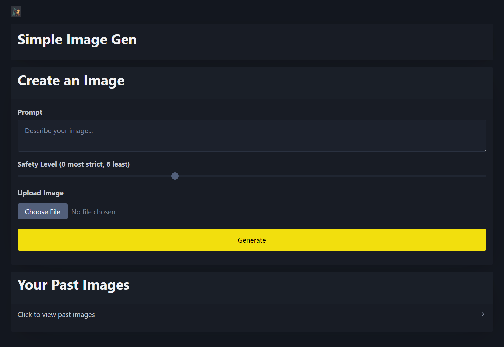

# SimpleImageGen

Wrapper for Flux on Fireworks.ai to make it simpler for my wife to generate images

My first vibe coding yolo app with no validation or anything

# Features

* Can provide a prompt to generate an image
* Can provide a prompt and upload a reference image to generate an image
* Slider bar for safety
* Store history of images in localstorage for reference later

# Running

* have Docker
* Copy `backend/sample.env` to `backend/.env`
* Put your fireworks.ai API key in `backend/.env`
* Run `./build.sh` 
