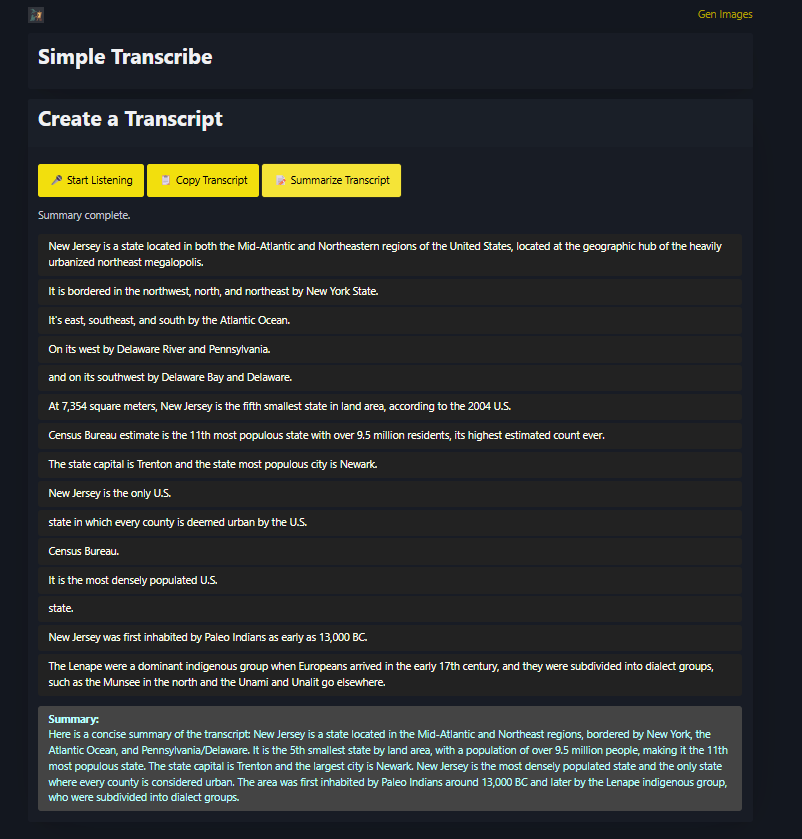

# SimpleImageGen

Wrapper for some common Fireworks.ai models to make it simpler for my wife to generate images and perform other tasks. 

It started as just a Flux wrapper, hence the name. Expanded to other tasks.

My first vibe coding yolo app with no validation or anything

# Features
## Image Generation

* Can provide a prompt to generate an image
* Can provide a prompt and upload a reference image to generate an image
* Slider bar for safety
* Store history of images in localstorage for reference later
* Utilizes the `FLUX.1 Kontext Pro` model for this
 

## Audio Transcription

* Will record your microphone (hence need for `https://`)
* In real time it will summarize what you are speaking
* When you have completed, stop recording
* Then you can either copy the transcript to your clipboard or
* You can send the transript to another model to summarize it
* Utilizes `Fireworks Streaming ASR` for transcription and `Llama 3.1 8B Instruct` for summarization

# Running

* have Docker
* Copy `backend/sample.env` to `backend/.env`
* Put your fireworks.ai API key in `backend/.env`
* Optionally put your TLS certificates in the `backend` folder. If you do not, they will be generated for you
* Run `./build.sh` 
* Visit on your port noting HTTPS as the protocol. It uses a self-signed certificate to permit microphone access.
